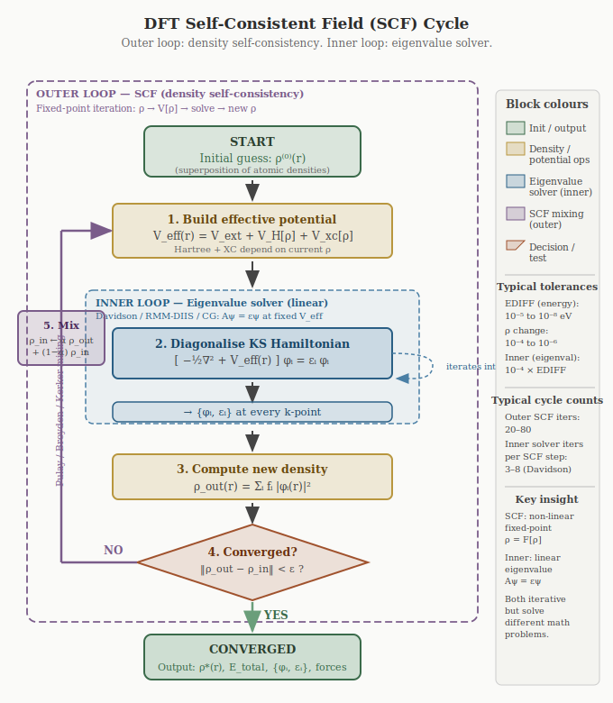

# Kohn-Sham Equations

The Hohenberg–Kohn theorems establish that the ground-state density \\(\rho_0(\mathbf{r})\\)
uniquely determines all ground-state properties, and that the total energy \\(E[\rho]\\) is minimised
by \\(\rho_0\\). However, they say nothing about *how* to compute the universal functional \\(F[\rho]\\),
and in particular how to evaluate the kinetic energy \\(T[\rho]\\) as a functional of the density
alone. As we saw with the Thomas–Fermi model in Chapter 1.6, attempts to write \\(T\\) purely in
terms of \\(\rho\\) using a local UEG ansatz lead to qualitative failures: no molecular binding,
wrong asymptotic decay, no shell structure.

The **Kohn–Sham (KS) formalism**, introduced by Walter Kohn and Lu Jeu Sham in 1965, provides
an elegant and highly accurate solution: introduce a fictitious system of **non-interacting
electrons** that, by construction, reproduces the exact ground-state density of the true
interacting system. By reintroducing single-particle orbitals — but only as a computational
device for the kinetic energy — KS theory salvages the rigour of the Hohenberg–Kohn theorems
while sidestepping the local-functional pitfalls of Thomas–Fermi. The result is a set of
effective single-particle equations — the Kohn–Sham equations — that are computationally
feasible while remaining formally exact.

## Decomposition of the Energy Functional

The key idea is to split the unknown universal functional \\(F[\rho]\\) into parts that can be
handled accurately and a remainder that must be approximated:

\begin{equation}
    E[\rho] = T_s[\rho] + E_{\mathrm{H}}[\rho] + E_{\mathrm{xc}}[\rho] + \int V_{\mathrm{ext}}(\mathbf{r})\, \rho(\mathbf{r}) \, d\mathbf{r},
    \label{eq:KS-energy}
\end{equation}

where each term has a specific physical meaning:

- \\(T_s[\rho]\\) is the **kinetic energy of a fictitious non-interacting system** with the same
  density \\(\rho(\mathbf{r})\\) as the real interacting system. Unlike the full kinetic energy
  \\(T[\rho]\\), this quantity can be computed exactly from the single-particle orbitals
  (see below).

- \\(E_{\mathrm{H}}[\rho]\\) is the **classical Hartree energy** — the electrostatic self-energy of
  the electron charge distribution, treating it as a classical continuous fluid:

\begin{equation}
    E_{\mathrm{H}}[\rho] = \frac{1}{2} \iint \frac{\rho(\mathbf{r})\, \rho(\mathbf{r}')}{|\mathbf{r} - \mathbf{r}'|} \, d\mathbf{r} \, d\mathbf{r}'.
\end{equation}

  This is the dominant part of the electron–electron repulsion and is treated exactly.

- \\(E_{\mathrm{xc}}[\rho]\\) is the **exchange-correlation (XC) energy**. It collects everything
  that is missing from the above terms:

\begin{equation}
    E_{\mathrm{xc}}[\rho] = \underbrace{(T[\rho] - T_s[\rho])}_{\text{kinetic correlation}} + \underbrace{(V_{ee}[\rho] - E_{\mathrm{H}}[\rho])}_{\text{exchange + correlation}}.
\end{equation}

  This includes the quantum exchange energy (the \\(K_{ij}\\) integrals introduced in
  Chapter 1.5.2), all Coulomb correlation effects beyond the Hartree level, and the correction
  to the kinetic energy from the interacting nature of the true system. \\(E_{\mathrm{xc}}\\) is
  the only term that must be approximated; its exact form is unknown.

- \\(\int V_{\mathrm{ext}}(\mathbf{r})\,\rho(\mathbf{r})\,d\mathbf{r}\\) is the **interaction with
  the external potential** (the nuclear attraction and any applied fields), treated exactly.

The Kohn–Sham ansatz reduces the DFT problem to finding a good approximation for \\(E_{\mathrm{xc}}[\rho]\\) — a functional of three-dimensional \\(\rho\\) alone — rather than solving the full
\\(3N\\)-dimensional Schrödinger equation.

## The Kohn–Sham Ansatz

The central assumption of the Kohn–Sham approach is:

> *There exists a system of non-interacting electrons — the KS reference system — whose
> ground-state density is identical to that of the true interacting system.*

**Non-interacting \\(v\\)-representability.** This assumption is not trivially guaranteed. It requires that the interacting ground-state density \\(\rho_0(\mathbf{r})\\) can be reproduced as the ground-state density of some non-interacting system moving in a local effective potential \\(V_{\rm eff}(\mathbf{r})\\). Densities for which this holds are called *non-interacting \\(v\\)-representable*. While a general proof is lacking, no physically relevant counterexample has been found, and the assumption is accepted as holding for all practical ground-state densities encountered in electronic structure calculations. The Kohn–Sham equations derived below are exact under this assumption.

The density is represented in terms of **Kohn–Sham orbitals** \\(\{\phi_i(\mathbf{r})\}\\):

\begin{equation}
    \rho(\mathbf{r}) = \sum_{i=1}^{N} |\phi_i(\mathbf{r})|^2.
    \label{eq:KS-density}
\end{equation}

The kinetic energy of the non-interacting reference system is then computed exactly from these
orbitals:

\begin{equation}
    T_s[\rho] = -\frac{1}{2}\sum_{i=1}^{N} \langle \phi_i | \nabla^2 | \phi_i \rangle
              = -\frac{1}{2}\sum_{i=1}^{N} \int \phi_i^*(\mathbf{r})\,\nabla^2\phi_i(\mathbf{r})\,d\mathbf{r}.
\end{equation}

This is the key advantage over orbital-free approaches like Thomas–Fermi: by working with orbitals we recover the exact non-interacting kinetic energy at the cost of introducing \\(N\\) single-particle functions.

## Derivation of the Kohn–Sham Equations

We seek the set of orbitals \\(\{\phi_i\}\\) that minimises the total KS energy functional
\eqref{eq:KS-energy}, subject to the constraint that the orbitals remain orthonormal:

\begin{equation}
    \langle \phi_i | \phi_j \rangle = \int \phi_i^*(\mathbf{r})\phi_j(\mathbf{r})\,d\mathbf{r} = \delta_{ij}.
\end{equation}

This is a constrained minimisation problem, which we solve using the method of Lagrange multipliers.
We construct the Lagrangian:

\begin{equation}
    \mathcal{L}[\{\phi_i\}] = E[\rho] - \sum_{i,j} \epsilon_{ij} \left( \langle \phi_i | \phi_j \rangle - \delta_{ij} \right),
\end{equation}

where \\(\epsilon_{ij}\\) are the Lagrange multipliers enforcing orthonormality. Taking the
functional derivative with respect to \\(\phi_i^*(\mathbf{r})\\) and setting it to zero yields:

\begin{equation}
    \frac{\delta E[\rho]}{\delta \phi_i^*(\mathbf{r})} = \sum_j \epsilon_{ij} \phi_j(\mathbf{r}).
\end{equation}

Applying the chain rule to the left-hand side — \\(T_s\\) is an explicit functional of the
orbitals, while \\(E_{\rm H}\\), \\(E_{\rm xc}\\), and \\(E_{\rm ext}\\) depend on the orbitals only
through the density \\(\rho(\mathbf{r}') = \sum_j|\phi_j(\mathbf{r}')|^2\\):

\begin{equation}
    \frac{\delta E[\rho]}{\delta \phi_i^*(\mathbf{r})} = \frac{\delta T_s}{\delta \phi_i^*(\mathbf{r})} + \int \frac{\delta (E_{\mathrm{H}} + E_{\mathrm{xc}} + E_{\mathrm{ext}})}{\delta \rho(\mathbf{r}')} \frac{\delta \rho(\mathbf{r}')}{\delta \phi_i^*(\mathbf{r})} \, d\mathbf{r}'.
\end{equation}

Evaluating the individual derivatives:
1. \\(\frac{\delta T_s}{\delta \phi_i^*(\mathbf{r})} = -\frac{1}{2}\nabla^2 \phi_i(\mathbf{r})\\) — standard variation of \\(T_s = -\tfrac{1}{2}\sum_j \int \phi_j^*\nabla^2\phi_j\,d\mathbf{r}\\).
2. \\(\frac{\delta \rho(\mathbf{r}')}{\delta \phi_i^*(\mathbf{r})} = \phi_i(\mathbf{r}')\delta(\mathbf{r}-\mathbf{r}')\\) — from \\(\rho(\mathbf{r}') = \sum_j |\phi_j(\mathbf{r}')|^2\\), differentiating with respect to \\(\phi_i^*(\mathbf{r})\\) picks out the \\(j = i\\) term and localises it at \\(\mathbf{r}' = \mathbf{r}\\).
3. \\(\frac{\delta E_{\mathrm{ext}}}{\delta \rho(\mathbf{r})} = V_{\mathrm{ext}}(\mathbf{r})\\) — from \\(E_{\rm ext} = \int V_{\rm ext}\rho\,d\mathbf{r}\\).
4. \\(\frac{\delta E_{\mathrm{H}}}{\delta \rho(\mathbf{r})} = \int \frac{\rho(\mathbf{r}')}{|\mathbf{r}-\mathbf{r}'|}\,d\mathbf{r}' \equiv V_{\mathrm{H}}(\mathbf{r})\\) — differentiating the symmetric double integral and exploiting symmetry to cancel the factor \\(\tfrac{1}{2}\\).
5. \\(\frac{\delta E_{\mathrm{xc}}}{\delta \rho(\mathbf{r})} \equiv V_{\mathrm{xc}}(\mathbf{r})\\) — by definition; this is the *exchange-correlation potential* whose explicit form is the subject of Chapter 4.

This defines the **Kohn–Sham effective potential**:

\begin{equation}
    V_{\mathrm{eff}}(\mathbf{r}) = V_{\mathrm{ext}}(\mathbf{r}) + V_{\mathrm{H}}(\mathbf{r}) + V_{\mathrm{xc}}(\mathbf{r}).
\end{equation}

The minimisation condition becomes:

\begin{equation}
    \left[ -\frac{1}{2}\nabla^2 + V_{\mathrm{eff}}(\mathbf{r}) \right] \phi_i(\mathbf{r}) = \sum_j \epsilon_{ij} \phi_j(\mathbf{r}).
\end{equation}

Because the Hamiltonian \\(\hat{h}_{\mathrm{KS}} = -\frac{1}{2}\nabla^2 + V_{\mathrm{eff}}\\) is Hermitian, the matrix of Lagrange multipliers \\(\epsilon_{ij}\\) is also Hermitian and can be diagonalised by a unitary transformation of the orbitals. This transformation leaves the total density \\(\rho(\mathbf{r})\\) unchanged. In this diagonal representation, we obtain the canonical **Kohn–Sham equations**:

\begin{equation}
    \boxed{ \left[ -\frac{1}{2}\nabla^2 + V_{\mathrm{eff}}(\mathbf{r}) \right] \phi_i(\mathbf{r}) = \epsilon_i \phi_i(\mathbf{r}) }
    \label{eq:KS-eqn}
\end{equation}

These are single-particle Schrödinger-like equations. The eigenvalues \\(\epsilon_i\\) are the Kohn–Sham orbital energies.

## The Self-Consistent Field (SCF) Cycle

The Kohn–Sham equations are non-linear: the effective potential \\(V_{\mathrm{eff}}(\mathbf{r})\\)
depends on \\(V_{\mathrm{H}}\\) and \\(V_{\mathrm{xc}}\\), which in turn depend on the density
\\(\rho(\mathbf{r})\\), which is computed from the orbitals \\(\phi_i(\mathbf{r})\\) that are the
solutions to the KS equations themselves. There is no way to write down the solution in closed
form: the equations must be solved **self-consistently** through iteration.

### SCF vs. Iterative Methods: Two Different Iterations

The term "iterative" is often used loosely in DFT, but two fundamentally different iterative
procedures are involved, and distinguishing them is essential for understanding how a calculation
actually runs.

**The SCF cycle is a fixed-point iteration.** The mathematical problem is to find a density
\\(\rho^*(\mathbf{r})\\) such that

\\[
    \rho^* = F[\rho^*], \qquad F[\rho] \equiv \sum_i |\phi_i[\rho](\mathbf{r})|^2,
\\]

where the right-hand side is constructed by (i) building \\(V_{\rm eff}[\rho]\\), (ii) solving the
KS equations for the orbitals, and (iii) summing the orbital densities. The map \\(F\\) is
**non-linear** in \\(\rho\\) — \\(V_{\rm H}\\) and \\(V_{\rm xc}\\) are non-linear functionals of the
density — so the fixed point cannot be found by direct linear algebra. Instead it is found by
iteration: \\(\rho^{(n+1)} = F[\rho^{(n)}]\\), possibly with mixing to ensure convergence (Chapter
8). The number of SCF iterations is typically 20–80 for a converged calculation.

**The eigenvalue solver is a linear iterative method.** Inside step (ii) of each SCF iteration,
the **linear** problem
\\[
    \hat{h}_{\rm KS}\,\phi_i = \epsilon_i\,\phi_i, \qquad \hat{h}_{\rm KS} = -\tfrac{1}{2}\nabla^2 + V_{\rm eff}(\mathbf{r}),
\\]
must be solved at fixed \\(V_{\rm eff}\\). This is a standard generalised eigenvalue problem, but
the matrix dimension \\(N_{\rm PW} \sim 10^4\\)–\\(10^5\\) is too large for direct diagonalisation
when only the lowest \\(N_{\rm bands} \sim 10^2\\)–\\(10^3\\) eigenpairs are needed. The practical
algorithms — Davidson, RMM-DIIS, conjugate gradients — are **iterative subspace methods**
(Chapter 10) that build up the desired eigenspace through successive matrix-vector products
\\(\hat{h}_{\rm KS}|\psi\rangle\\). They typically converge in 3–8 inner iterations per SCF step.

The two iterations are **nested**: the outer SCF loop calls the inner eigenvalue solver as a
subroutine at every step. They share the property of being iterative and producing convergence
plots, but they solve different mathematical problems with different convergence theories:

| Feature | SCF (outer) | Eigenvalue solver (inner) |
|---|---|---|
| Mathematical problem | Non-linear fixed point \\(\rho = F[\rho]\\) | Linear eigenvalue \\(A\mathbf{x} = \lambda\mathbf{x}\\) |
| Variable | Density \\(\rho(\mathbf{r})\\) | Orbital coefficients \\(\{c_{\mathbf{G},i}\}\\) |
| Convergence theory | Banach fixed-point + spectral analysis of Jacobian | Krylov subspace / Rayleigh–Ritz |
| Acceleration | Pulay/Broyden mixing (Chapter 8) | Davidson/RMM-DIIS subspace expansion (Chapter 10) |
| Diagnostic | "SCF iteration N: ΔE = ..." | "RMM-DIIS: rms = ..."  per band |
| Failure mode | Charge sloshing, oscillation | Band mixing, eigenvalue stalling |
| Typical iter. count | 20–80 | 3–8 per SCF step |

A typical DFT calculation therefore performs \\(\mathcal{O}(100–500)\\) inner eigenvalue
iterations in total. Both must converge for the calculation to succeed; failure of one
manifests differently from failure of the other.

### The SCF Algorithm

In practice, the SCF procedure is:

1. **Initial guess**: Provide a starting density \\(\rho^{(0)}(\mathbf{r})\\), typically a
   superposition of atomic densities (VASP `ICHARG = 2`, QE `startingpot = 'atomic'`).
2. **Construct effective potential**: Calculate \\(V_{\mathrm{H}}[\rho]\\) (via the Poisson
   equation, usually in reciprocal space) and \\(V_{\mathrm{xc}}[\rho]\\) (by evaluating the XC
   functional on the real-space grid). Assemble
   \\(V_{\rm eff}(\mathbf{r}) = V_{\rm ext} + V_{\rm H} + V_{\rm xc}\\).
3. **Solve KS equations (inner loop)**: Diagonalise the KS Hamiltonian at each
   \\(\mathbf{k}\\)-point via an iterative subspace method (Davidson, RMM-DIIS), obtaining
   the orbitals \\(\phi_i^{(n+1)}(\mathbf{r})\\) and energies \\(\epsilon_i\\). This step is
   itself iterative — see the "inner loop" terminology above.
4. **Construct new density**: Determine occupations \\(f_i\\) from the Fermi level (Chapter 9
   smearing), and form
   \\(\rho_{\rm out}^{(n+1)}(\mathbf{r}) = \sum_i f_i\,|\phi_i^{(n+1)}(\mathbf{r})|^2\\).
5. **Check convergence**: If the total energy change \\(|E^{(n+1)} - E^{(n)}|\\) and the density
   change \\(\|\rho_{\rm out} - \rho_{\rm in}\|\\) are both below their respective tolerances
   (typically \\(10^{-5}\\)–\\(10^{-8}\\) eV for energy), stop and report the converged ground
   state.
6. **Mix** (if not converged): Construct the input density for the next SCF iteration as a
   weighted combination of input and output densities using Pulay, Broyden, or Kerker mixing
   (Chapter 8), then return to step 2.

This procedure is shown schematically in Figure 3.1.

<figure>

<figcaption style="text-align:center; font-size:0.9em; color:#555;">

**Figure 3.1.** The DFT SCF cycle. The **outer loop** (purple dashed border) implements
density self-consistency: a non-linear fixed-point iteration \\(\rho = F[\rho]\\) accelerated
by mixing schemes. The **inner loop** (blue dashed border) implements the linear eigenvalue
solver \\(\hat{h}_{\rm KS}\phi = \epsilon\phi\\) at fixed effective potential, itself an
iterative method (Davidson, RMM-DIIS) that builds the eigenspace through matrix-vector
products. The two iterations are nested: a typical calculation requires 20–80 outer SCF steps,
each invoking the inner solver for 3–8 iterations per \\(\mathbf{k}\\)-point. The blocks are
colour-coded by role: green for initialisation and output, gold for density/potential
operations, blue for the eigenvalue solver, plum for SCF mixing, and terracotta for the
convergence test.

</figcaption>
</figure>

The details of the mixing algorithms in step 6 and the inner eigenvalue solver in step 3 are
sufficiently involved that they receive their own chapters: Chapter 8 develops density mixing
schemes (linear, Kerker, Pulay/DIIS, Broyden), and Chapter 10 develops iterative
diagonalisation (Davidson, RMM-DIIS, conjugate gradients).

## Physical Meaning of Kohn–Sham Quantities

It is crucial to understand what the KS framework does and does not claim to represent physically.

### The Total Energy

The total ground-state energy is **not** simply the sum of the KS orbital energies. Summing the
eigenvalues gives:

\begin{equation}
    \sum_i \epsilon_i = \sum_i \langle \phi_i | -\frac{1}{2}\nabla^2 + V_{\mathrm{eff}} | \phi_i \rangle
    = T_s[\rho] + \int V_{\mathrm{eff}}(\mathbf{r})\rho(\mathbf{r})\,d\mathbf{r}.
\end{equation}

Substituting the definition of \\(V_{\mathrm{eff}}\\):

\begin{equation}
    \sum_i \epsilon_i = T_s[\rho] + \int V_{\mathrm{ext}}\rho\,d\mathbf{r} + \int V_{\mathrm{H}}\rho\,d\mathbf{r} + \int V_{\mathrm{xc}}\rho\,d\mathbf{r}.
\end{equation}

Comparing this to the exact total energy \eqref{eq:KS-energy}, we see that the Hartree and XC
interactions have been double-counted in the eigenvalue sum. The correct total energy must be
reconstructed by subtracting the double-counting terms:

\begin{equation}
    E[\rho] = \sum_i \epsilon_i - E_{\mathrm{H}}[\rho] - \int V_{\mathrm{xc}}(\mathbf{r})\rho(\mathbf{r})\,d\mathbf{r} + E_{\mathrm{xc}}[\rho].
\end{equation}

### The KS Orbitals and Eigenvalues

In exact DFT, the fictitious KS orbitals \\(\phi_i\\) and their energies \\(\epsilon_i\\) have **no
strict physical meaning**, with one exception: the **highest occupied KS eigenvalue** equals
the negative of the first ionisation energy of the exact many-body system:

\begin{equation}
    \epsilon_{\mathrm{HOMO}}^{\mathrm{exact}} = -I.
\end{equation}

This **IP theorem** was established independently by Almbladh and von Barth (1985) and
Levy–Perdew–Sahni (1984) using the asymptotic form of the exact density at large \\(|\mathbf{r}|\\). The result is *not* a direct consequence of Janak's theorem (Janak 1978), which states the
distinct identity \\(\epsilon_i = \partial E/\partial f_i\\) (the KS eigenvalue is the derivative
of the total energy with respect to its occupation number). Janak's theorem applied at integer
\\(N\\) gives the chemical potential, and combined with the long-range behaviour of the exact
density yields \\(\epsilon_{\rm HOMO} = -I\\); both ingredients are required.

The other eigenvalues \\(\epsilon_i\\) do not formally correspond to electron removal or addition
energies (quasiparticle excitations). The KS "band gap" (\\(\epsilon_{\mathrm{LUMO}} - \epsilon_{\mathrm{HOMO}}\\)) systematically underestimates the true fundamental gap, even if the
exact XC functional were used. This is due to the **derivative discontinuity** of the exact XC
functional with respect to particle number.

Despite this, KS orbitals and eigenvalues are widely (and somewhat informally) used to
interpret band structures, density of states, and orbital energies, and often agree
qualitatively with experiment, but this agreement is not guaranteed by the theory.

Formally correct excitation spectra require going beyond ground-state DFT, e.g. via
**Time-Dependent DFT (TDDFT)** or many-body perturbation theory (**GW approximation**).

## Summary

The Kohn–Sham scheme reduces the interacting many-body problem to a set of effective
single-particle equations \eqref{eq:KS-eqn} that can be solved efficiently on modern computers.
The key steps and ideas are:

| Concept | Role |
|---|---|
| Non-interacting reference system | Enables exact computation of \\(T_s[\rho]\\) via orbitals |
| \\(V_{\mathrm{H}}\\) | Classical mean-field Coulomb repulsion, computed exactly |
| \\(V_{\mathrm{xc}}\\) | All many-body quantum effects, must be approximated |
| SCF loop | Resolves the self-consistency between density and potential |
| XC approximation (LDA, GGA, …) | The only uncontrolled approximation in the KS framework |

The formal exactness of the KS framework — all errors traceable to a single approximated term —
combined with its single-particle structure makes DFT the workhorse of electronic structure
theory. In the chapters that follow, we will examine how this framework is implemented in
practice: basis sets, pseudopotentials, \\(k\\)-point sampling, and the computational details of
solving the KS equations for real materials.
