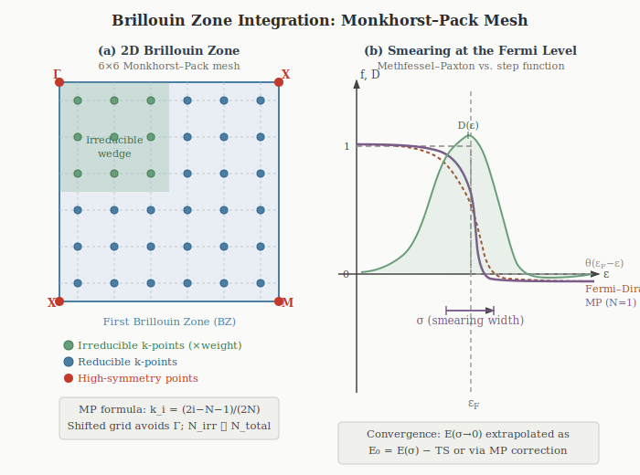

# Brillouin Zone Integration

Chapter 8 addressed the outer loop of the SCF cycle: how to update the density from one
iteration to the next so that the fixed-point equation \\(F[\rho^*] = \rho^*\\) is satisfied
efficiently. This chapter addresses two pieces of numerical machinery that operate *within*
each SCF step: how the BZ integral is discretised onto a finite \\(\mathbf{k}\\)-point mesh
(Section: Monkhorst–Pack Sampling), and how the occupation function near the Fermi level is
regularised to achieve rapid convergence for metals (Section: Smearing). The eigenvalue solver
that produces the orbitals and energies at each \\(\mathbf{k}\\)-point is treated separately in
Chapter 10. BZ integration is covered first because the choice of \\(\mathbf{k}\\)-mesh and
smearing scheme affects the effective smoothness of the energy landscape seen by the SCF cycle.


## Monkhorst–Pack \\(k\\)-Point Sampling

<figure>

<figcaption style="text-align:center; font-size:0.9em; color:#555;">

**Figure 9.1.** *(a)* A 6×6 Monkhorst–Pack mesh in a 2D square Brillouin zone. Green points
are the irreducible k-points (related by symmetry to the full set); blue points are the
symmetry-equivalent reducible set. The irreducible wedge (shaded green) reduces the
computational cost by the order of the point group. *(b)* Occupation function \\(f(\epsilon)\\)
and density of states \\(D(\epsilon)\\) near the Fermi level for a metal. The step function
(grey dashed) requires infinite k-point density; Fermi–Dirac (terracotta) and
Methfessel–Paxton (plum) smearings regularise the integral at the cost of a finite broadening
\\(\sigma\\), which must be corrected or extrapolated to zero.

</figcaption>
</figure>
In a periodic solid, all physical observables require integration over the first Brillouin zone.
The electron density, total energy, and density of states are all BZ integrals of the form:

<div>
\begin{equation}
    \langle A \rangle = \frac{\Omega_{\rm BZ}}{(2\pi)^3}\int_{\rm BZ} A(\mathbf{k})\,d\mathbf{k}
    \approx \sum_{\mathbf{k} \in \mathcal{S}} w_{\mathbf{k}}\,A(\mathbf{k}),
    \label{eq:BZ-integral}
\end{equation}
</div>

where the continuous integral is replaced by a weighted sum over a discrete set
\\(\mathcal{S}\\) of \\(\mathbf{k}\\)-points with weights \\(w_{\mathbf{k}}\\) summing to unity.
The central question is: how to choose \\(\mathcal{S}\\) so that the sum converges to the
integral as rapidly as possible?

### The Monkhorst–Pack Grid

The **Monkhorst–Pack (MP) scheme** (Monkhorst and Pack, 1976) places a uniform grid of
\\(N_1 \times N_2 \times N_3\\) \\(\mathbf{k}\\)-points in the BZ, centred so as to avoid the
\\(\Gamma\\) point (which is often a high-symmetry point requiring special treatment):

<div>
\begin{equation}
    \mathbf{k}_{n_1 n_2 n_3} = \sum_{i=1}^{3} \frac{2n_i - N_i - 1}{2N_i}\,\mathbf{b}_i,
    \qquad n_i = 1,\ldots,N_i,
    \label{eq:MP-grid}
\end{equation}
</div>

where \\(\mathbf{b}_i\\) are the primitive reciprocal lattice vectors. For an odd \\(N_i\\), the grid
includes \\(\Gamma\\); for even \\(N_i\\), it is shifted by half a grid spacing and avoids \\(\Gamma\\).
The total number of \\(\mathbf{k}\\)-points in the full BZ is \\(N_{\rm tot} = N_1 N_2 N_3\\).

**Reducing by symmetry.** The crystal point group \\(G\\) maps each \\(\mathbf{k}\\) to a set of
symmetry-equivalent points. Only the **irreducible \\(\mathbf{k}\\)-points** — one representative
from each equivalence class — need to be computed explicitly; the rest contribute through their
multiplicity weights \\(w_{\mathbf{k}} = |\text{orbit}(\mathbf{k})|/N_{\rm tot}\\). For a cubic
crystal with \\(N \times N \times N\\) MP grid, the full BZ has \\(N^3\\) points but the irreducible
wedge contains only \\(\sim N^3/48\\) (for Oh symmetry). A \\(12 \times 12 \times 12\\) mesh has
1728 points total but only \\(\sim 72\\) irreducible \\(\mathbf{k}\\)-points for bcc Fe — a factor-of-24
saving.

**Convergence rate.** For a smooth, periodic integrand (insulators, gapped systems), the
trapezoidal rule on a uniform grid converges **exponentially** with \\(N\\). For metals with a
Fermi surface discontinuity, convergence degrades to \\(\mathcal{O}(1/N^2)\\) at best and is
oscillatory — this is the problem that smearing methods resolve.

### Convergence Testing

The \\(\mathbf{k}\\)-point convergence of a calculation must always be tested explicitly. The
standard protocol:

1. Fix all other parameters (\\(E_{\rm cut}\\), \\(\sigma\\), geometry).
2. Compute the total energy for a sequence of meshes: \\(4^3, 6^3, 8^3, 10^3, 12^3, \ldots\\)
3. Plot the energy per atom vs. \\(1/N_k\\) (or \\(1/N_k^{1/3}\\)). For insulators, convergence
   is exponential and the curve drops quickly; for metals, it is a slower power law.
4. Declare convergence when the energy change between successive meshes is below your target
   threshold (typically \\(1\\)–\\(5\\) meV/atom for structural properties; \\(<1\\) meV/atom for
   energy differences and phase stability).

Typical converged meshes by system type:

| System type | Typical mesh | k-points (irreducible) |
|---|---|---|
| Insulator / semiconductor (primitive cell) | \\(6\times6\times6\\) | \\(\sim 16\\)–\\(32\\) |
| Simple metal (primitive cell) | \\(12\times12\times12\\) | \\(\sim 72\\)–\\(120\\) |
| Transition metal (bcc/fcc primitive) | \\(16\times16\times16\\) | \\(\sim 120\\)–\\(200\\) |
| Magnetic supercell (\\(\sim 50\\) atoms) | \\(4\times4\times4\\) | \\(\sim 8\\)–\\(20\\) |
| Surface slab | \\(12\times12\times1\\) | \\(\sim 40\\)–\\(80\\) |
| Molecular (large box) | \\(\Gamma\\)-only | \\(1\\) |

For supercells, the BZ folds: a \\(2\times2\times2\\) supercell of a primitive-cell calculation
with an \\(N\times N\times N\\) mesh is equivalent in k-point density to an
\\((N/2)\times(N/2)\times(N/2)\\) mesh of the primitive cell. Always compare meshes at the same
**k-point density** (points per unit length in reciprocal space), not the same grid indices.

<figure>

<figcaption style="text-align:center; font-size:0.9em; color:#555;">

**Figure 9.1.** *(a)* A 6×6 Monkhorst–Pack mesh on a 2D square Brillouin zone. Green points
are the irreducible \\(\mathbf{k}\\)-points; blue points are symmetry-equivalent images.
The irreducible wedge (shaded) reduces the number of SCF diagonalisations by the order of
the point group. *(b)* Occupation function \\(f(\epsilon)\\) near \\(\epsilon_F\\) for a metal.
The ideal step function (grey dashed) converges slowly; Fermi–Dirac (terracotta) and
Methfessel–Paxton \\(N=1\\) (plum) smearings regularise the integral at the cost of a
broadening \\(\sigma\\) that must be converged or corrected.

</figcaption>
</figure>

<details>
<summary><b>Code Notes: k-point setup in VASP and Quantum ESPRESSO</b></summary>

**VASP** — the `KPOINTS` file controls the mesh. The most common format for an automatic MP grid:

```
Automatic
0
Monkhorst-Pack
 12 12 12
  0  0  0
```

The last line is the shift (0 0 0 = grid includes Γ; 1 1 1 = shifted half a step, avoids Γ
for even-numbered grids). For hexagonal systems, use `Gamma`-centred grids (replace
`Monkhorst-Pack` with `Gamma`) to preserve the 3-fold symmetry.

**Quantum ESPRESSO** — set in the `&K_POINTS` card of `pw.x`:

```
K_POINTS automatic
12 12 12  0 0 0
```

The three integers are \\(N_1 N_2 N_3\\); the last three are shifts (0 = no shift, 1 = shift by
\\(1/(2N_i)\\)). Use `K_POINTS gamma` for \\(\Gamma\\)-only calculations (molecules, large
supercells).

</details>


## Smearing and Partial Occupancies


### The Problem with Sharp Occupation

The KS total energy involves a sum over occupied states weighted by occupation numbers \\(f_i\\).
For an insulator at zero temperature, every state below the gap has \\(f_i = 1\\) and every state
above has \\(f_i = 0\\). The Brillouin zone (BZ) integral for any smooth quantity — the total
energy, charge density, or density of states — converges exponentially with the density of the
\\(\mathbf{k}\\)-point mesh, because the integrand is an analytic function of \\(\mathbf{k}\\)
throughout the BZ. A \\(6 \times 6 \times 6\\) Monkhorst–Pack grid is often sufficient for a
well-converged insulator calculation.

For a metal, the situation is qualitatively different. The occupation function is a step
function at the Fermi energy:

<div>
\begin{equation}
    f_i(\mathbf{k}) = \theta(\epsilon_F - \epsilon_i(\mathbf{k})),
    \label{eq:step-occupation}
\end{equation}
</div>

which is discontinuous at the **Fermi surface** — the set of \\(\mathbf{k}\\)-points where
\\(\epsilon_i(\mathbf{k}) = \epsilon_F\\). The BZ integral of a function with a discontinuity
converges only as \\(\mathcal{O}(1/N_k)\\) with the number of \\(\mathbf{k}\\)-points \\(N_k\\), and
the approach to convergence is oscillatory (the **Gibbs phenomenon**). In practice, this means
that a metallic calculation with sharp occupations requires an extremely dense \\(\mathbf{k}\\)-mesh
— often \\(20 \times 20 \times 20\\) or finer — to achieve meV-level convergence, making the
calculation prohibitively expensive.

The physical origin is clear: the Fermi surface is a measure-zero set in the BZ, but the energy
integral samples it through a finite \\(\mathbf{k}\\)-mesh. States that are just above or just
below \\(\epsilon_F\\) make discontinuous contributions to the energy as the mesh is refined —
a state that is occupied on one mesh may become unoccupied on a slightly denser mesh, causing
the total energy to jump.

All smearing methods address this by replacing the discontinuous step function with a smooth
approximation, effectively broadening the Fermi surface over an energy window of width \\(\sigma\\).
This converts the BZ integrand from a discontinuous to a smooth (or even analytic) function,
restoring rapid convergence with \\(\mathbf{k}\\)-point density — at the cost of introducing a
systematic error that must be controlled or corrected.

### Gaussian Smearing

The simplest approach replaces the step function with a smooth occupation based on the
complementary error function:

<div>
\begin{equation}
    \boxed{f_i = \frac{1}{2}\,\mathrm{erfc}\!\left(\frac{\epsilon_i - \epsilon_F}{\sigma}\right),}
    \label{eq:gaussian-occ}
\end{equation}
</div>

where \\(\sigma \gt 0\\) is the **smearing width** and \\(\mathrm{erfc}(x) = 1 - \mathrm{erf}(x) =
\frac{2}{\sqrt{\pi}}\int_x^\infty e^{-t^2}\,dt\\). This corresponds to convolving the step
function with a Gaussian of width \\(\sigma\\): states more than \\(\sim 2\sigma\\) below \\(\epsilon_F\\)
have \\(f_i \approx 1\\); states more than \\(\sim 2\sigma\\) above have \\(f_i \approx 0\\); and states
within \\(\sim \sigma\\) of \\(\epsilon_F\\) have fractional occupations.

The smearing introduces a systematic error in the total energy. For a system with a slowly
varying density of states near \\(\epsilon_F\\), the error scales as:

<div>
\begin{equation}
    E[\sigma] - E_0 = \mathcal{O}(\sigma^2),
    \label{eq:gaussian-error}
\end{equation}
</div>

where \\(E_0\\) is the true zero-temperature energy. To obtain \\(E_0\\), one must either use a very
small \\(\sigma\\) (which reintroduces the convergence problem) or extrapolate.

**The free energy and the \\(\sigma \to 0\\) extrapolation.** The smeared system can be interpreted
as a fictitious finite-temperature ensemble with an electronic entropy:

<div>
\begin{equation}
    S = -k_B \sum_{i,\mathbf{k}} w_\mathbf{k}\left[f_i \ln f_i + (1 - f_i)\ln(1 - f_i)\right],
    \label{eq:entropy}
\end{equation}
</div>

where \\(w_\mathbf{k}\\) is the \\(\mathbf{k}\\)-point weight. The corresponding **free energy** is:

<div>
\begin{equation}
    F[\sigma] = E[\sigma] - \sigma\, S.
    \label{eq:free-energy}
\end{equation}
</div>

For a system with a parabolic density of states near \\(\epsilon_F\\) (a good approximation for
simple metals), the total energy and free energy bracket the true \\(E_0\\):

<div>
\begin{equation}
    E[\sigma] = E_0 + a\sigma^2 + \mathcal{O}(\sigma^4), \qquad
    F[\sigma] = E_0 - a\sigma^2 + \mathcal{O}(\sigma^4),
    \label{eq:E-F-expansion}
\end{equation}
</div>

with the *same* coefficient \\(a\\) but opposite signs. Averaging eliminates the \\(\sigma^2\\) error:

<div>
\begin{equation}
    \boxed{E_0 \approx \frac{1}{2}\left(E[\sigma] + F[\sigma]\right) + \mathcal{O}(\sigma^4).}
    \label{eq:sigma-extrapolation}
\end{equation}
</div>

This is the **\\(\sigma \to 0\\) extrapolation**. Most plane-wave codes report this corrected
energy alongside the raw total energy and the free energy; it is the value that should be used
for comparing total energies, computing energy differences, and extracting formation energies —
*not* the raw \\(E[\sigma]\\) or \\(F[\sigma]\\) individually.

**Limitation:** the extrapolation assumes a smoothly varying density of states. For systems with
sharp features near \\(\epsilon_F\\) (van Hove singularities, narrow \\(d\\)-bands), the quadratic
approximation breaks down and larger errors can persist even after extrapolation.

### Fermi–Dirac Smearing

A physically motivated alternative uses the Fermi–Dirac distribution directly:

<div>
\begin{equation}
    \boxed{f_i = \frac{1}{1 + \exp\!\left(\frac{\epsilon_i - \epsilon_F}{k_B T}\right)},}
    \label{eq:FD-occ}
\end{equation}
</div>

where \\(T\\) is interpreted as the electronic temperature and \\(\sigma = k_BT\\) plays the same role
as the Gaussian smearing width. The advantage is physical transparency: Fermi–Dirac smearing
corresponds to the *exact* equilibrium occupation at temperature \\(T\\). The variational quantity
is the **Mermin free energy**:

<div>
\begin{equation}
    \Omega = E - TS,
    \label{eq:mermin}
\end{equation}
</div>

where \\(S\\) is the exact Fermi–Dirac entropy. For genuine finite-temperature calculations — ab
initio molecular dynamics above \\(\sim 1000\,\\)K, warm dense matter, or the electronic
contribution to free energies — Fermi–Dirac smearing is the physically correct choice.

For ground-state calculations at \\(T = 0\\), Fermi–Dirac smearing has a disadvantage: the
occupation function has exponential tails extending to \\(\pm\infty\\), meaning that states far
from \\(\epsilon_F\\) acquire small but non-zero fractional occupations. This is physically correct
at finite \\(T\\) but introduces an \\(\mathcal{O}(\sigma^2)\\) error at \\(T = 0\\) that is larger than
the corresponding error from Methfessel–Paxton smearing at the same \\(\sigma\\). The \\(\sigma \to 0\\)
extrapolation of equation \eqref{eq:sigma-extrapolation} can still be applied, but with lower
accuracy than Methfessel–Paxton for ground-state energy differences.

### Methfessel–Paxton Smearing

The Gaussian and Fermi–Dirac methods both introduce an \\(\mathcal{O}(\sigma^2)\\) error in the
total energy. **Methfessel–Paxton (MP) smearing** (Methfessel and Paxton, 1989) systematically
reduces this error by expanding the \\(\delta\\)-function approximation in a complete set of
Hermite polynomials, achieving \\(\mathcal{O}(\sigma^{2N+2})\\) accuracy at order \\(N\\).

The construction starts from the identity: the step function \\(\theta(x)\\) can be written as
\\(\frac{1}{2}\,\mathrm{erfc}(x)\\) plus a correction expressible as a series in Hermite
polynomials \\(H_n(x)\\). The key mathematical result is that the Hermite polynomials, weighted by
the Gaussian \\(e^{-x^2}\\), form a complete orthogonal set on \\((-\infty, \infty)\\). Expanding the
difference \\(\theta(x) - \frac{1}{2}\,\mathrm{erfc}(x)\\) in this basis and truncating at order
\\(N\\) gives the MP approximation to the \\(\delta\\)-function:

<div>
\begin{equation}
    \tilde{\delta}_N(x) = \frac{e^{-x^2}}{\sqrt{\pi}} \sum_{n=0}^{N} A_n H_{2n}(x),
    \label{eq:MP-delta}
\end{equation}
</div>

where \\(x = (\epsilon_i - \epsilon_F)/\sigma\\) and the coefficients are
\\(A_n = (-1)^n / (n!\, 4^n\sqrt{\pi})\\). The corresponding occupation function is obtained by
integration:

<div>
\begin{equation}
    f_N(x) = \int_x^\infty \tilde{\delta}_N(t)\,dt.
    \label{eq:MP-occupation-general}
\end{equation}
</div>

**The \\(N = 0\\) case** recovers Gaussian smearing: \\(\tilde{\delta}_0(x) = e^{-x^2}/\sqrt{\pi}\\),
\\(f_0(x) = \frac{1}{2}\,\mathrm{erfc}(x)\\), with error \\(\mathcal{O}(\sigma^2)\\).

**The \\(N = 1\\) case** is derived explicitly. The first Hermite polynomial correction adds
\\(A_1 H_2(x) = -\frac{1}{4\sqrt{\pi}}(4x^2 - 2)\\) to the \\(\delta\\)-function. Integrating gives:

<div>
\begin{equation}
    \boxed{f_1(x) = \frac{1}{2}\,\mathrm{erfc}(x) + \frac{1}{\sqrt{\pi}}\,x\,e^{-x^2},
    \qquad x = \frac{\epsilon_i - \epsilon_F}{\sigma}.}
    \label{eq:MP-N1}
\end{equation}
</div>

Note that \\(f_1(x)\\) is *not* monotonic and can take values slightly outside \\([0,1]\\): for
\\(x \approx -1\\), the occupation exceeds \\(1\\) slightly, and for \\(x \approx 1\\), it dips below \\(0\\).
This is not a pathology — the occupation numbers in MP smearing are *not* probabilities but
mathematical weights designed to minimise the BZ integration error. The total electron count
\\(\sum_i f_i = N\\) is still exactly conserved.

The crucial property is that the energy error now scales as \\(\mathcal{O}(\sigma^4)\\) rather than
\\(\mathcal{O}(\sigma^2)\\):

<div>
\begin{equation}
    E_{N=1}[\sigma] = E_0 + \mathcal{O}(\sigma^4).
    \label{eq:MP-N1-error}
\end{equation}
</div>

This means that for \\(N \geq 1\\), the raw energy \\(E[\sigma]\\) is already a good approximation to
\\(E_0\\) without the \\(\sigma \to 0\\) extrapolation. In practice, the extrapolated energy is still
computed and should still be used, but the correction it applies is much smaller than for
Gaussian smearing at the same \\(\sigma\\).

**The \\(N = 2\\) case** adds the next Hermite correction, achieving
\\(\mathcal{O}(\sigma^6)\\) accuracy. For most applications, \\(N = 1\\) is sufficient; \\(N = 2\\)
provides a useful cross-check but rarely changes results by more than \\(\sim 0.1\,\\)meV/atom at
typical smearing widths.

**Why not \\(N \gt 2\\)?** Higher-order MP approximations produce occupation functions with
increasingly large oscillations outside \\([0,1]\\), which can cause numerical instabilities in
the SCF cycle (large negative occupations can make the charge density locally negative). The
practical consensus is that \\(N = 1\\) or \\(N = 2\\) gives the optimal balance between accuracy and
numerical stability.

### The Tetrahedron Method

All smearing methods introduce a fictitious broadening that must be controlled or corrected.
The **tetrahedron method** (Jepsen and Andersen, 1971; Blöchl, Jepsen, and Andersen, 1994)
takes a fundamentally different approach: it performs the BZ integral *exactly* for a piecewise
linear interpolation of the band energies \\(\epsilon_i(\mathbf{k})\\), without introducing any
broadening parameter.

**Decomposition.** The BZ is partitioned into a regular \\(\mathbf{k}\\)-mesh. Each parallelepiped
of the mesh is subdivided into six congruent tetrahedra (the natural simplicial decomposition
of a 3D cell). Within each tetrahedron \\(T\\) with vertices \\(\mathbf{k}_1,\ldots,\mathbf{k}_4\\)
and band energies \\(\epsilon_n = \epsilon_i(\mathbf{k}_n)\\) (sorted so \\(\epsilon_1 \leq \epsilon_2 \leq \epsilon_3 \leq \epsilon_4\\)), the band energy is **linearly interpolated**:

\\[
    \tilde\epsilon_i(\mathbf{k}) = \sum_{n=1}^{4} \alpha_n(\mathbf{k})\,\epsilon_n,
    \qquad \mathbf{k} \in T,
\\]

where \\(\alpha_n(\mathbf{k})\\) are the barycentric coordinates of \\(\mathbf{k}\\) in \\(T\\), with
\\(\sum_n \alpha_n = 1\\). The integration of the step function \\(\theta(\epsilon_F - \tilde\epsilon)\\)
over the linear interpolant inside \\(T\\) is then a purely geometric problem: the level set
\\(\tilde\epsilon = \epsilon_F\\) is a plane that cuts \\(T\\) into two polyhedra.

**Analytic weights.** Carrying out the integral analytically gives the **tetrahedron weights**
\\(w_n(\epsilon_F)\\), which depend on where \\(\epsilon_F\\) sits relative to the four vertex
energies \\(\epsilon_n\\). The standard results (Blöchl 1994; for the volume integral
\\(\int_T \theta(\epsilon_F - \tilde\epsilon)/V_T\\)) are:

| Regime | Filled fraction of \\(T\\) |
|---|---|
| \\(\epsilon_F < \epsilon_1\\) | \\(0\\) (tetrahedron empty) |
| \\(\epsilon_1 \leq \epsilon_F < \epsilon_2\\) | \\(\dfrac{(\epsilon_F - \epsilon_1)^3}{(\epsilon_2-\epsilon_1)(\epsilon_3-\epsilon_1)(\epsilon_4-\epsilon_1)}\\) |
| \\(\epsilon_2 \leq \epsilon_F < \epsilon_3\\) | piecewise cubic in \\(\epsilon_F\\) (one truncated corner) |
| \\(\epsilon_3 \leq \epsilon_F < \epsilon_4\\) | \\(1 - \dfrac{(\epsilon_4 - \epsilon_F)^3}{(\epsilon_4-\epsilon_1)(\epsilon_4-\epsilon_2)(\epsilon_4-\epsilon_3)}\\) |
| \\(\epsilon_F \geq \epsilon_4\\) | \\(1\\) (tetrahedron full) |

The vertex weights \\(w_n\\) (the fraction of the integration measure attributable to vertex \\(n\\))
follow by differentiation: \\(w_n = \partial[\text{filled fraction}]/\partial\epsilon_n\\). The total
electron count is then \\(N_{\rm el} = \sum_{i,T}\sum_n w_n^{i,T}(\epsilon_F)\\), and the Fermi
energy \\(\epsilon_F\\) is determined by the implicit equation \\(N_{\rm el}(\epsilon_F) = N\\).
Solving for \\(\epsilon_F\\) is done by bisection over a sorted list of all vertex energies; the
resulting integration is **exact** for any function that is piecewise linear on the tetrahedral
mesh.

**The Blöchl correction.** The linear interpolant misses the curvature of \\(\epsilon_i(\mathbf{k})\\)
within each tetrahedron. The dominant correction is the second-derivative contribution that
arises from the Taylor expansion of the true band energy around the tetrahedron centroid.
Blöchl, Jepsen, and Andersen (1994) showed that adding the correction

\\[
    \Delta w_n = \frac{1}{40}\sum_T D_T(\epsilon_F)\!\sum_{m=1}^4 (\epsilon_m - \epsilon_n),
\\]

where \\(D_T(\epsilon_F)\\) is the density of states from tetrahedron \\(T\\) at \\(\epsilon_F\\),
restores fourth-order accuracy: the integration error scales as \\(\mathcal{O}(N_k^{-4})\\) rather
than the \\(\mathcal{O}(N_k^{-2})\\) of the uncorrected linear interpolation. The correction is
the second-derivative analogue of Simpson's rule for the BZ integral — it costs essentially
nothing extra (the DOS at \\(\epsilon_F\\) is already computed) and reduces the \\(\mathbf{k}\\)-mesh
density needed for a target accuracy by a factor of 2–3 in each direction. This corrected
tetrahedron method is the gold standard for BZ integration accuracy and is selected in VASP by
`ISMEAR = -5` (`tetrahedra_opt` in QE).

**Advantages:** No smearing parameter to choose or converge. No entropy correction needed. Exact
for any quantity that depends linearly on \\(\epsilon_i(\mathbf{k})\\) within each tetrahedron;
fourth-order accurate with the Blöchl correction. Produces smooth, non-oscillatory convergence
with \\(\mathbf{k}\\)-mesh density.

**Limitations:** The tetrahedron method requires the BZ integral to be performed over a regular
mesh — it cannot be used with symmetry-reduced or randomly shifted \\(\mathbf{k}\\)-sets without
additional care. More importantly, the analytic integration assumes a fixed band structure: the
Fermi energy and the tetrahedron weights are computed *after* the eigenvalues are known, so
there is no smooth dependence of the total energy on atomic positions. This means the forces
computed from a tetrahedron-method calculation contain small but non-zero discontinuities when
an eigenvalue crosses \\(\epsilon_F\\) as atoms move, making the tetrahedron method **unsuitable
for geometry optimisation or molecular dynamics** of metallic systems. For these tasks, MP
smearing (\\(N = 1\\)) is preferred.

The tetrahedron method is, however, the optimal choice for:
fixed-geometry total energy calculations, density of states (DOS) and projected DOS, optical
properties and spectral functions, and any post-processing quantity requiring accurate spectral
weight near the Fermi level.

### Practical Guidance

The choice of smearing method and width depends on both the system type and the type of
calculation:

| Calculation type | System | Recommended method | \\(\sigma\\) |
|---|---|---|---|
| Geometry optimisation | Metal | MP \\(N=1\\) | \\(0.1\\)–\\(0.2\\) eV |
| Geometry optimisation | Insulator | Gaussian or tetrahedron | \\(0.05\\)–\\(0.1\\) eV (or none) |
| Single-point energy | Metal | Tetrahedron (Blöchl) | — |
| Single-point energy | Insulator | Tetrahedron (Blöchl) | — |
| DOS / optical properties | Any | Tetrahedron (Blöchl) | — |
| AIMD (\\(T \gt 1000\,\\)K) | Metal | Fermi–Dirac | \\(k_BT\\) |
| Phonons (DFPT) | Metal | MP \\(N=1\\) | \\(0.1\\)–\\(0.2\\) eV |

**Choosing \\(\sigma\\):** The smearing width must be large enough to smooth the Fermi surface
sufficiently for the given \\(\mathbf{k}\\)-mesh, but small enough that the smearing error is
acceptable. A useful diagnostic: if the entropy term \\(TS\\) exceeds \\(\sim 1\,\\)meV/atom, the
smearing is too large and either \\(\sigma\\) should be reduced or the \\(\mathbf{k}\\)-mesh should be
made denser.

**The interdependence of \\(\sigma\\) and \\(\mathbf{k}\\)-mesh:** These two parameters are not
independent. A denser \\(\mathbf{k}\\)-mesh resolves the Fermi surface better, allowing a smaller
\\(\sigma\\); conversely, a larger \\(\sigma\\) compensates for a coarser mesh. The product
\\(\sigma \times N_k^{1/3}\\) should remain approximately constant for a given target accuracy.
In practice, one converges both simultaneously: fix \\(\sigma\\), increase the \\(\mathbf{k}\\)-mesh
until the energy is stable, then reduce \\(\sigma\\) and repeat until both are converged.

**Marzari–Vanderbilt cold smearing:** An alternative to MP smearing that ensures the occupation
function remains non-negative while achieving comparable accuracy (Marzari et al., 1999). It
avoids the slight negative occupations of MP \\(N \geq 1\\) that can occasionally cause numerical
difficulties. Available in several codes as an option alongside Gaussian and MP smearing.

<details>
<summary><b>Code Notes: VASP and Quantum ESPRESSO Parameters</b></summary>

**VASP:**

| Parameter | Controls | Values |
|---|---|---|
| `ISMEAR` | Smearing method | \\(-5\\): tetrahedron (Blöchl); \\(-1\\): Fermi–Dirac; \\(0\\): Gaussian; \\(1\\): MP \\(N=1\\); \\(2\\): MP \\(N=2\\) |
| `SIGMA` | Smearing width \\(\sigma\\) (eV) | \\(0.01\\)–\\(0.3\\); default \\(0.2\\) |

The extrapolated energy `energy(sigma->0)` in the OUTCAR corresponds to equation
\eqref{eq:sigma-extrapolation} for Gaussian smearing and to the raw energy (with negligible
correction) for MP \\(N \geq 1\\). Always use this value for energy comparisons. The entropy
contribution is reported as `EENTRO`.

`ISMEAR = -5` (tetrahedron) must not be used with fewer than \\(3\\) \\(\mathbf{k}\\)-points in any
direction, or for calculations where forces are needed (geometry optimisation, MD). VASP will
run but the forces will contain discontinuities that prevent smooth convergence of the ionic
relaxation.

**Quantum ESPRESSO:**

| Parameter | Controls | Values |
|---|---|---|
| `occupations` | Occupation scheme | `'smearing'`, `'tetrahedra'`, `'tetrahedra_opt'` (Blöchl), `'fixed'` |
| `smearing` | Smearing function | `'gaussian'`, `'fermi-dirac'`, `'methfessel-paxton'`, `'marzari-vanderbilt'` |
| `degauss` | Smearing width \\(\sigma\\) (Ry) | Typical: \\(0.005\\)–\\(0.02\\) Ry (\\(0.07\\)–\\(0.27\\) eV) |

Note that QE uses Rydberg units for `degauss` (\\(1\,\\)Ry \\(= 13.606\,\\)eV), while VASP uses eV for
`SIGMA`. A common source of error is confusing the two: `degauss = 0.02` Ry \\(\approx 0.27\,\\)eV,
which is a reasonable smearing for metals; `SIGMA = 0.02` eV is extremely small and may cause
convergence problems on a coarse \\(\mathbf{k}\\)-mesh.

Marzari–Vanderbilt cold smearing is accessed via `smearing = 'marzari-vanderbilt'` or
`smearing = 'cold'`.

</details>

<details>
<summary><b>Further Reading</b></summary>

- **Methfessel–Paxton smearing:** M. Methfessel and A. T. Paxton, *High-precision sampling for
  Brillouin-zone integration in metals*, Phys. Rev. B **40**, 3616 (1989). The original paper
  deriving the Hermite polynomial expansion and the error scaling \\(\mathcal{O}(\sigma^{2N+2})\\).

- **Tetrahedron method with Blöchl correction:** P. E. Blöchl, O. Jepsen, and O. K. Andersen,
  *Improved tetrahedron method for Brillouin-zone integrations*, Phys. Rev. B **49**, 16223
  (1994). Derives the quadratic correction that improves convergence from
  \\(\mathcal{O}(1/N_k^2)\\) to \\(\mathcal{O}(1/N_k^4)\\).

- **Original tetrahedron method:** O. Jepsen and O. K. Andersen, *The electronic structure of
  h.c.p. ytterbium*, Solid State Commun. **9**, 1763 (1971).

- **Marzari–Vanderbilt cold smearing:** N. Marzari, D. Vanderbilt, A. De Vita, and M. C. Payne,
  *Thermal contraction and disordering of the Al(110) surface*, Phys. Rev. Lett. **82**, 3296
  (1999). Introduces the cold smearing function with improved convergence properties for metals.

- **Mermin finite-temperature DFT:** N. D. Mermin, *Thermal properties of the inhomogeneous
  electron gas*, Phys. Rev. **137**, A1441 (1965). The formal foundation for Fermi–Dirac
  smearing as a finite-temperature variational principle.

- **General discussion:** The interplay between \\(\mathbf{k}\\)-mesh density and smearing is
  discussed clearly in G. Kresse and J. Furthmüller, Phys. Rev. B **54**, 11169 (1996),
  Section II.D.

</details>
